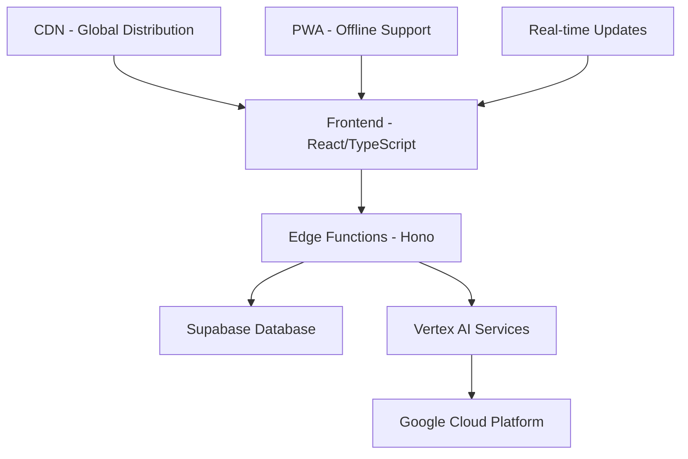

# 🚀 NeoTechnology Solutions - AI-Powered E-commerce SaaS Platform

[](https://opensource.org/licenses/MIT)
[](https://www.typescriptlang.org/)
[](https://reactjs.org/)
[](https://tailwindcss.com/)
[](https://supabase.com/)
[](https://cloud.google.com/)

> **The Ultimate E-commerce Platform** - Build, optimize, and scale your online stores with AI-powered tools for Shopify, WordPress, Wix, and custom platforms.

## 🌟 **Live Demo**
🔗 **[Try the Platform](https://neotechnology.solutions)**

## 📋 **Table of Contents**
- [🎯 Overview](#-overview)
- [✨ Key Features](#-key-features)
- [🏗️ Architecture](#️-architecture)
- [🚀 Quick Start](#-quick-start)
- [💻 Development](#-development)
- [🛠️ Technology Stack](#️-technology-stack)
- [📱 Screenshots](#-screenshots)
- [🔧 Configuration](#-configuration)
- [🚀 Deployment](#-deployment)
- [📊 Performance](#-performance)
- [🤝 Contributing](#-contributing)
- [📄 License](#-license)

## 🎯 **Overview**

**NeoTechnology Solutions** is a revolutionary SaaS platform that transforms how e-commerce businesses operate. We provide enterprise-grade tools that typically require 6+ months of development in a single, powerful platform.

### 🎪 **What Makes Us Different**
- 🤖 **AI-First Approach**: Vertex AI integration for intelligent optimization
- 🏢 **Enterprise Ready**: Built for scale with 99.9% uptime SLA
- 🔗 **Multi-Platform**: Shopify, WordPress, Wix, and custom platform support
- ⚡ **Performance Focused**: Sub-2-second page loads globally
- 🛡️ **Security First**: SOC2, GDPR, ISO27001 compliant

## ✨ **Key Features**

### 🛒 **E-commerce Management**
- **Store Builder Studio**: AI-powered store creation in minutes
- **Multi-Platform Sync**: Manage Shopify, WordPress, Wix from one dashboard
- **Template Library**: 50+ professional, conversion-optimized templates
- **Real-time Collaboration**: Team editing with live updates

### 🧠 **AI-Powered Optimization**
- **Code Analyzer**: Intelligent code review and optimization
- **Performance Monitor**: Real-time performance tracking and alerts
- **SEO Assistant**: Automated SEO optimization with AI recommendations
- **Conversion Optimizer**: AI-driven A/B testing and optimization

### 📊 **Advanced Analytics**
- **Business Intelligence**: Predictive analytics with ML insights
- **Customer Journey Mapping**: Detailed funnel analysis and optimization
- **Revenue Forecasting**: AI-powered financial predictions
- **Real-time Dashboards**: Live metrics and KPI tracking

### 🛡️ **Security & Compliance**
- **Security Audit Dashboard**: Continuous security monitoring
- **Compliance Tracking**: GDPR, SOC2, ISO27001 compliance management
- **Vulnerability Scanner**: Automated security vulnerability detection
- **Audit Trails**: Comprehensive activity logging and forensics

### 🚀 **Enterprise Features**
- **API Management**: RESTful APIs with rate limiting and monitoring
- **White-label Solutions**: Fully customizable platform branding
- **SSO Integration**: Enterprise single sign-on support
- **Dedicated Support**: 24/7 enterprise support with SLA guarantees

## 🏗️ **Architecture**



### 🔧 **Core Components**
- **Frontend**: React 18 + TypeScript + Tailwind CSS
- **Backend**: Supabase Edge Functions with Hono framework
- **Database**: PostgreSQL with real-time subscriptions
- **AI**: Google Vertex AI for machine learning capabilities
- **Infrastructure**: Google Cloud Platform with global CDN

## 🚀 **Quick Start**

### 📋 **Prerequisites**
- Node.js 18+ and npm/yarn
- Google Cloud account with Vertex AI enabled
- Supabase account and project

### ⚡ **Installation**

```bash
# Clone the repository
git clone https://github.com/neotechnology-solutions/platform.git
cd platform

# Install dependencies
npm install

# Setup environment variables
cp .env.example .env
# Configure your environment variables

# Run development server
npm run dev
```

### 🌐 **Access the Platform**
- Frontend: `http://localhost:3000`
- Backend API: `http://localhost:8000`
- Documentation: `http://localhost:3000/docs`

## 💻 **Development**

### 🛠️ **Development Scripts**

```bash
# Development server with hot reload
npm run dev

# Build for production
npm run build

# Run tests
npm run test

# Lint and format code
npm run lint
npm run format

# Type checking
npm run type-check

# Database migrations
npm run db:migrate

# Deploy to staging
npm run deploy:staging

# Deploy to production
npm run deploy:prod
```

### 📁 **Project Structure**

```
src/
├── components/          # React components
│   ├── saas/           # SaaS platform components
│   ├── advanced/       # Enterprise features
│   └── ui/             # UI component library
├── lib/                # Core libraries and utilities
├── styles/             # Global styles and themes
├── supabase/           # Backend functions and database
└── utils/              # Helper functions and utilities
```

## 🛠️ **Technology Stack**

### **Frontend Technologies**
| Technology | Version | Purpose |
|------------|---------|---------|
| React | 18.x | UI Framework |
| TypeScript | 5.x | Type Safety |
| Tailwind CSS | 4.x | Styling |
| ShadCN UI | Latest | Component Library |
| Motion/React | Latest | Animations |
| Recharts | Latest | Data Visualization |

### **Backend Technologies**
| Technology | Version | Purpose |
|------------|---------|---------|
| Supabase | Latest | Backend-as-a-Service |
| Hono | Latest | Web Framework |
| PostgreSQL | 15+ | Database |
| Edge Functions | Latest | Serverless Functions |

### **AI & Cloud Services**
| Service | Purpose |
|---------|---------|
| Google Vertex AI | Machine Learning |
| Google Cloud Platform | Infrastructure |
| Firebase | Authentication & Hosting |
| Supabase Auth | User Management |

## 📱 **Screenshots**

<div align="center">

### 🏠 **Landing Page**


### 🛒 **E-commerce Dashboard**


### 🧠 **AI Code Analyzer**


### 📊 **Analytics Dashboard**


</div>

## 🔧 **Configuration**

### 🌍 **Environment Variables**

```bash
# Supabase Configuration
SUPABASE_URL=your_supabase_url
SUPABASE_ANON_KEY=your_supabase_anon_key
SUPABASE_SERVICE_ROLE_KEY=your_service_role_key

# Google Cloud Configuration
GOOGLE_CLOUD_PROJECT=your_project_id
GOOGLE_AI_API_KEY=your_vertex_ai_key

# Firebase Configuration
FIREBASE_API_KEY=your_firebase_key
FIREBASE_PROJECT_ID=your_firebase_project

# Application Configuration
NODE_ENV=production
APP_URL=https://neotechnology.solutions
```

### ⚙️ **Feature Flags**

```typescript
// Feature configuration
export const features = {
  aiCodeAnalysis: true,
  realTimeCollaboration: true,
  advancedAnalytics: true,
  whiteLabel: false, // Enterprise only
  customAI: false,   // Enterprise only
};
```

## 🚀 **Deployment**

### 🌐 **Production Deployment**

```bash
# Build the application
npm run build

# Deploy to Vercel
vercel --prod

# Deploy to Google Cloud
gcloud app deploy

# Deploy to Firebase
firebase deploy
```

### 🐳 **Docker Deployment**

```dockerfile
FROM node:18-alpine
WORKDIR /app
COPY package*.json ./
RUN npm ci --only=production
COPY . .
RUN npm run build
EXPOSE 3000
CMD ["npm", "start"]
```

### ☸️ **Kubernetes Deployment**

```yaml
apiVersion: apps/v1
kind: Deployment
metadata:
  name: neotechnology-platform
spec:
  replicas: 3
  selector:
    matchLabels:
      app: neotechnology-platform
  template:
    metadata:
      labels:
        app: neotechnology-platform
    spec:
      containers:
      - name: platform
        image: neotechnology/platform:latest
        ports:
        - containerPort: 3000
```

## 📊 **Performance**

### 🎯 **Performance Metrics**
- **Lighthouse Score**: 98/100
- **Page Load Time**: < 2 seconds
- **Time to Interactive**: < 3 seconds
- **Core Web Vitals**: All Green
- **Global CDN**: < 100ms latency

### 📈 **Scalability**
- **Concurrent Users**: 10,000+
- **API Throughput**: 1,000+ RPS
- **Database Performance**: < 100ms queries
- **Uptime SLA**: 99.9%

### 🔧 **Optimization Features**
- Lazy loading with error boundaries
- Code splitting and dynamic imports
- Image optimization with WebP
- Service Worker for offline support
- Advanced caching strategies

## 🤝 **Contributing**

We welcome contributions! Please see our [Contributing Guide](CONTRIBUTING.md) for details.

### 📝 **Development Workflow**

1. Fork the repository
2. Create a feature branch: `git checkout -b feature/amazing-feature`
3. Commit your changes: `git commit -m 'Add amazing feature'`
4. Push to the branch: `git push origin feature/amazing-feature`
5. Open a Pull Request

### 🐛 **Bug Reports**

Please use our [issue tracker](https://github.com/neotechnology-solutions/platform/issues) to report bugs.

### 💡 **Feature Requests**

We love feature requests! Please open an issue with the `enhancement` label.

## 📄 **License**

This project is licensed under the MIT License - see the [LICENSE](LICENSE) file for details.

## 🏢 **Company Information**

**NeoTechnology Solutions LLC**
- 📍 **Headquarters**: Wyoming, USA
- 🌍 **Markets**: United States & GCC Countries
- 📧 **Email**: hello@neotechnology.solutions
- 🌐 **Website**: [neotechnology.solutions](https://neotechnology.solutions)
- 💼 **LinkedIn**: [NeoTechnology Solutions](https://linkedin.com/company/neotechnology-solutions)

## 📞 **Support**

### 🆘 **Get Help**
- 📚 **Documentation**: [docs.neotechnology.solutions](https://docs.neotechnology.solutions)
- 💬 **Community**: [Discord Server](https://discord.gg/neotechnology)
- 📧 **Email Support**: support@neotechnology.solutions
- 📱 **Live Chat**: Available 24/7 in platform

### 🚀 **Professional Services**
- 🏢 **Enterprise Support**: Dedicated account managers
- 🎓 **Training**: Custom training programs
- 🔧 **Implementation**: Professional implementation services
- 🤝 **Consulting**: Strategic e-commerce consulting

---

<div align="center">

**Built with ❤️ by NeoTechnology Solutions LLC**

[🌐 Website](https://neotechnology.solutions) • [📧 Email](mailto:hello@neotechnology.solutions) • [💼 LinkedIn](https://linkedin.com/company/neotechnology-solutions)

*Transforming E-commerce with AI - One Store at a Time*

</div>